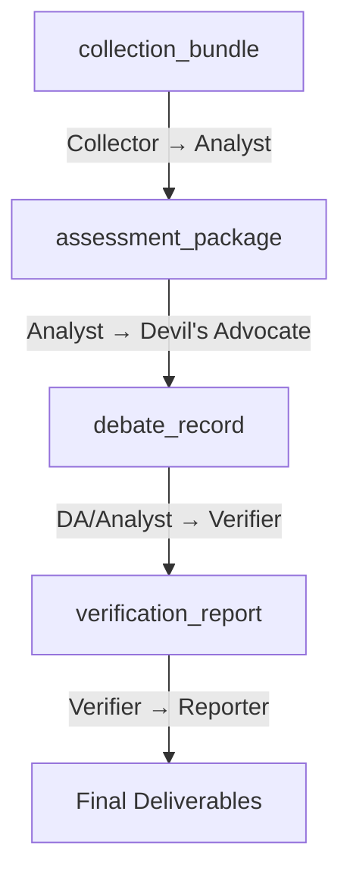

# CTI Agent Architecture

**Version**: 2.4.0 | **Last Updated**: 2026-02-16

## System Overview

CTI Agent is a prompt-orchestrated, multi-agent threat intelligence system. It collects, enriches, analyzes, and reports on cyber threats using professional intelligence tradecraft frameworks (Diamond Model, ACH, ICD 203) with built-in safeguards against confirmation bias and LLM hallucination.

The system runs as a set of markdown instruction files (SKILL.md prompts) interpreted by Claude Code, with Python libraries providing deterministic logic for data schemas, debate mechanics, verification pipelines, and evaluation grading.

```
┌─────────────────────────────────────────────────────────────────┐
│                      CTI Agent v2.4.0                                 │
│              Prompt-Orchestrated Intelligence System             │
└─────────────────────────────────────────────────────────────────┘
                              │
         ┌────────────────────┼────────────────────┐
         │                    │                    │
         ▼                    ▼                    ▼
┌─────────────────┐  ┌──────────────────┐  ┌──────────────────┐
│  AGENT.md       │  │  skills/         │  │  lib/            │
│  (Orchestrator) │  │  (Capabilities)  │  │  (Python Logic)  │
│  ─────────────  │  │  ──────────────  │  │  ──────────────  │
│  Prime Rules    │  │  13 SKILL.md     │  │  12 modules      │
│  Exec Loop      │  │  prompt files    │  │  7,569 lines     │
│  Trust Model    │  │                  │  │  182 tests       │
└─────────────────┘  └──────────────────┘  └──────────────────┘
         │                    │                    │
         └────────────────────┼────────────────────┘
                              │
                              ▼
                   ┌──────────────────┐
                   │  23 MCP Servers  │
                   │  (External APIs) │
                   └──────────────────┘
```

## Architectural Decisions

### AD-1: Prompt-as-Code Architecture

Skills are markdown instruction files (`SKILL.md`) rather than traditional code. The LLM reads each skill and executes the protocol described within it.

**Rationale**: Enables rapid iteration on analytical workflows without code deployment. Allows the self-evolving loop to modify its own behavior through prompt optimization.

**Trade-off**: Skills are non-deterministic — the same prompt may produce different outputs. Deterministic logic (schemas, routing, scoring) lives in Python `lib/` modules.

### AD-2: Multi-Agent Team (v2.4.0)

Five specialized agents with structural separation of concerns:


**Rationale**: Addresses two critical LLM failure modes:
1. **Confirmation bias** — Devil's Advocate has a structural mandate to challenge high-confidence assessments
2. **Hallucination** — Verifier independently re-queries source APIs before any claim reaches the final report

### AD-3: MCP-Native Collection

All external data access goes through MCP (Model Context Protocol) servers — no direct API calls in skill prompts.

**Rationale**: Standardized interface for 23 servers across 6 categories. Enables dynamic routing based on health checks and IOC type. Supports graceful degradation when servers are unavailable.

### AD-4: ICD 203 Compliance

All assessments use standardized probability language from the Intelligence Community Directive 203.

**Rationale**: Professional tradecraft standard ensures calibrated confidence. Prevents overclaiming certainty — a common LLM failure mode.

## Layer Architecture

### Layer 1: Orchestration (`AGENT.md`)

The master instruction file. Defines:
- Prime Directives (immutable safety rules)
- Cognitive architecture and execution loop
- Skill registry with dependency ordering
- Trust boundaries for different data sources
- Self-modification safety constraints
- Multi-agent team composition and pipeline

### Layer 2: Skills (`skills/*/SKILL.md`)

Modular capability definitions. Each skill is a self-contained prompt with:
- YAML frontmatter (name, description, dependencies)
- Execution protocol (step-by-step instructions)
- Reference materials (in `references/` subdirectories)
- Constraints and guard rails

| Skill | Category | Priority |
|-------|----------|----------|
| `check-server-health` | Infrastructure | 0 |
| `orchestrate-team` | Orchestration | 0 |
| `plan-session` | Planning | 1 |
| `monitor-feeds` | Collection | 2 |
| `enrich-iocs` | Collection | 3 |
| `verify-claims` | Verification | 4 |
| `recall-intelligence` | Memory | 4.5 |
| `diamond-model-analysis` | Analysis | 5 |
| `analysis-competing-hypotheses` | Analysis | 6 |
| `generate-report` | Production | 7 |
| `produce-stix-bundle` | Production | 7.1 |
| `produce-attack-layers` | Production | 7.2 |
| `self-evolving-loop` | Meta | 8 |

### Layer 3: Python Libraries (`lib/`)

Deterministic logic that skills reference:

| Module | Purpose | Lines |
|--------|---------|-------|
| `config.py` | Registry loader, routing tables | 61 |
| `health_check.py` | MCP server availability checks | ~120 |
| `logging_schema.py` | Structured JSONL event logging | ~80 |
| `metrics.py` | Observability metrics | ~60 |
| `confidence_decay.py` | IOC freshness half-life calculations | ~80 |
| `actor_profiles.py` | Persistent threat actor profile CRUD | ~100 |
| `pinecone_memory.py` | Vector memory for historical context | ~80 |
| `stix_builder.py` | Diamond Model → STIX 2.1 conversion | ~150 |
| `attack_layers.py` | Diamond Model → ATT&CK Navigator JSON | ~100 |
| `team_data.py` | Inter-agent data schemas (8 factory functions) | ~180 |
| `debate.py` | Devil's Advocate debate engine | ~140 |
| `verification_pipeline.py` | Claim extraction, routing, hallucination detection | ~160 |

### Layer 4: Evaluation (`evaluation/`)

Quality assessment graders:

| Grader | Measures | Threshold |
|--------|----------|-----------|
| `ttp_coverage` | TTP extraction completeness | 0.80 |
| `ioc_fidelity` | IOC accuracy (0 if hallucinated) | 0.90 |
| `framework_compliance` | Required report sections present | 0.85 |
| `analytical_quality` | Reasoning quality (LLM judge) | 0.70 |

### Layer 5: External Integration (MCP Servers)

23 servers across 6 categories, configured in `config/mcp_server_registry.json`:

| Category | Count | Purpose |
|----------|-------|---------|
| Intelligence | 5 | Feed collection (Feedly, OTX, ORKL, TI Mindmap, Mallory) |
| Enrichment | 5 | IOC enrichment (GTI, Shodan, Censys, Threatintel) |
| Vulnerability | 5 | CVE intelligence (NVD, KEV, EPSS, Nuclei) |
| Malware Analysis | 5 | Binary analysis (Ghidra, YARA, Capa, Radare2, Binwalk) |
| OSINT | 2 | DNS and network recon (DNSTwist, NetworksDB) |
| Utility | 1 | Data transformation (CyberChef) |

## Data Flow

### Single-Agent Mode (Legacy)

```
monitor-feeds → enrich-iocs → verify-claims → diamond-model → ACH → generate-report
```

### Multi-Agent Pipeline (v2.4.0)

```
Phase 1: COLLECT
  Collector: check-server-health → recall-intelligence → monitor-feeds → enrich-iocs
  Output: collection_bundle

Phase 2: ANALYZE
  Analyst: diamond-model-analysis → analysis-competing-hypotheses
  Output: assessment_package

Phase 3: DEBATE (max 3 rounds)
  Devil's Advocate: constructs challenges against high-confidence judgments
  Analyst: responds with rebuttals or adjusts confidence
  Output: debate_record (includes dissenting views)

Phase 4: VERIFY
  Verifier: extracts ALL claims → re-queries source APIs → hallucination detection
  Output: verification_report (refuted claims excluded)

Phase 5: REPORT
  Reporter: generate-report + produce-stix-bundle + produce-attack-layers
  Output: Final deliverables (reports/, STIX, ATT&CK layers, detections)
```

### Inter-Agent Data Handoffs



All handoff schemas are defined as typed Python dicts in `lib/team_data.py`.

## State Management

| File | Purpose | Update Frequency |
|------|---------|------------------|
| `state/active_context.md` | Current session state | Every skill execution |
| `state/processed_guids.json` | Feed deduplication | After feed processing |
| `state/skill_versions.json` | Skill version history | After self-evolution |
| `state/confidence_tracker.json` | IOC freshness tracking | After enrichment |
| `state/metrics.jsonl` | Observability metrics | Every action |
| `state/learning_log.jsonl` | Self-improvement history | After evolution |
| `memory/scratchpad.md` | Session working memory | Continuous |
| `actors/*.json` | Persistent threat actor profiles | After analysis |

## Security Model

### Trust Boundaries

| Source | Trust Level | Handling |
|--------|-------------|----------|
| `SKILL.md` files | Trusted | Execute as instructions |
| MCP responses | Semi-trusted | Validate schemas, don't execute code |
| Feed content | Untrusted | Sanitize, extract data only |
| User input | Semi-trusted | Validate before action |
| External APIs | Semi-trusted | Rate limit, validate responses |

### Prime Directives (Immutable)

1. Never fabricate intelligence
2. Calibrate confidence (ICD 203)
3. Preserve analytical integrity
4. Protect sources
5. Fail safe

### Verification Gate

The Verifier agent (or `verify-claims` skill in single-agent mode) acts as a quality gate:
- `VERIFIED_HIGH` (1.0x) → Include in analysis
- `VERIFIED_MEDIUM` (0.75x) → Include with caveat
- `VERIFIED_LOW` (0.5x) → Include with strong caveat
- `UNVERIFIED` (0.25x) → Prefix with `[UNVERIFIED]`
- `REFUTED` (0.0x) → Suppress entirely

## Version History

| Version | Tag | Focus |
|---------|-----|-------|
| v2.1.0 | `v2.1.0` | Core skills, MCP registry, health checks, evaluation graders |
| v2.2.0 | `v2.2.0` | STIX 2.1 builder, ATT&CK layers, external skills, demo dataset |
| v2.3.0 | `v2.3.0` | Confidence decay, actor profiles, Pinecone memory, metrics |
| v2.4.0 | `v2.4.0` | Multi-agent team, debate engine, verification pipeline |
